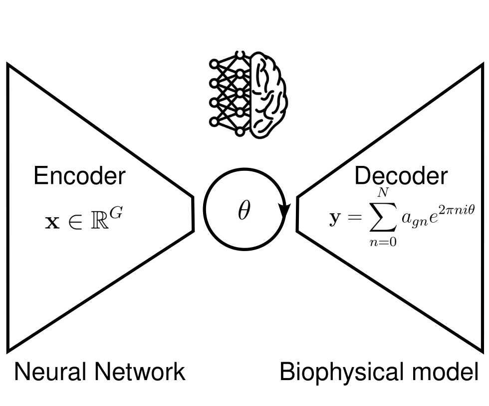

# Ciclopes

**Ciclopes** is a *biology-informed* deep learning tool for inferring **cell cycle phase** from **single-cell resolution data**, including both **scRNA-seq** and **spatial transcriptomics** datasets.

## Overview

Ciclopes combines prior biological knowledge of cell cycle marker genes with a deep generative model that captures the **oscillatory dynamics** of gene expression during the cell cycle. It provides smooth, interpretable, and continuous representations of cell cycle progression, beyond discrete phase assignments.

## Key Features

- **Biology-informed initialization**  
  Uses curated S-phase and G2/M-phase marker genes to compute initial scores, ensuring biologically grounded starting points.

- **Hybrid deep learning–biophysical model**  
  The model integrates a neural network encoder with a mechanistic decoder:
  - **Encoder:** Maps gene expression profiles to a *1D circular latent variable* representing the cell cycle phase.  
  - **Decoder:** Reconstructs expression using a **Fourier series**, modeling oscillatory transcriptional behavior.

- **Supports multiple data types**  
  Works seamlessly with both **single-cell RNA-seq** and **spatial transcriptomics** data.

- **Interpretable circular latent space**  
  The inferred latent variable corresponds to the progression through the cell cycle.

## Model Architecture

**Input**  
  Gene expression (Sanity LTQs recommended) of genes exhibiting an oscillatory dynamics, $G$-dimensional vector  
**Latent space**  
  Cell cycle phase, $\theta$, 1-dimensional circular varibale  
**Output**  
  Gene expression recontructed using Fourier series, $G$-dimensional vector  

### Dependencies
Python ≥ 3.9  
PyTorch ≥ 2.0  
Scanpy   
Numpy, Pandas, Matplotlib  

